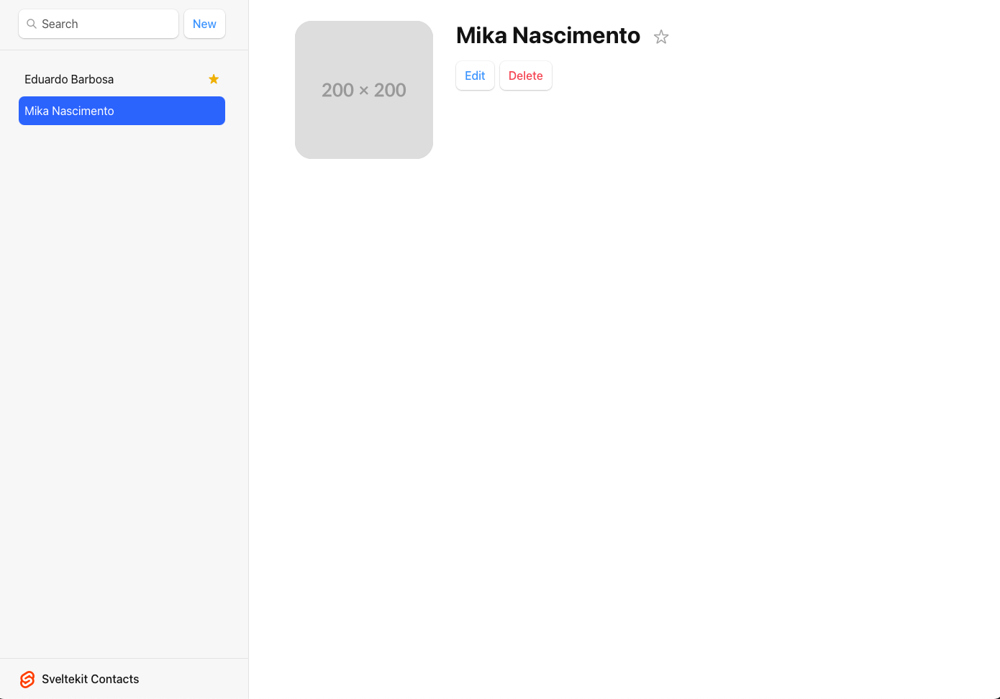
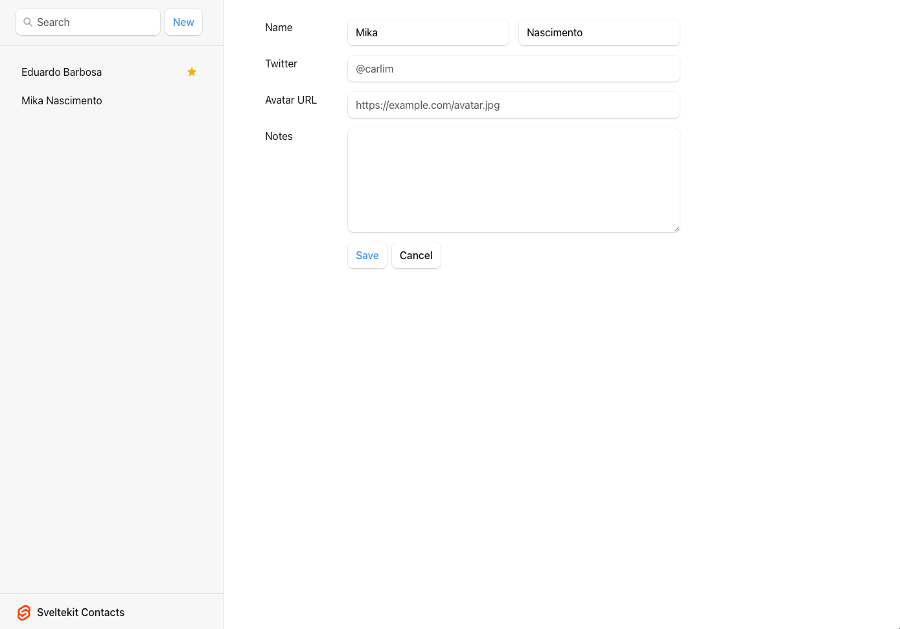

# Sveltekit Tutorial

This is a sample SvelteKit project adapted from the [Remix tutorial](https://remix.run/docs/en/main/start/tutorial#remix-tutorial)


## Preview





## Here are some things I’ve learned:

- Adding styles
- Nested routes
- Layouts
- Data loading
- Data mutation
- Optimistic UI

## Technologies

- [Sveltekit](https://svelte.dev/docs/kit/introduction)
- [unstorage](https://unstorage.unjs.io)


## How to start the project

1 - Install dependencies:

```bash
pnpm install
```

2 - Start the dvelopment server:

```bash
npm run dev
```